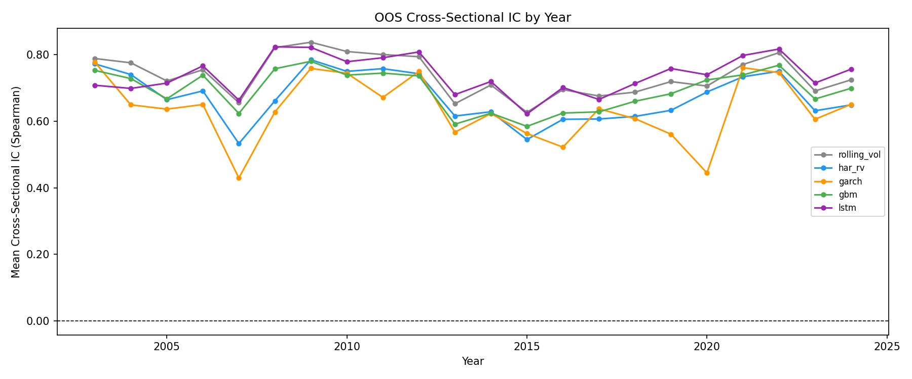
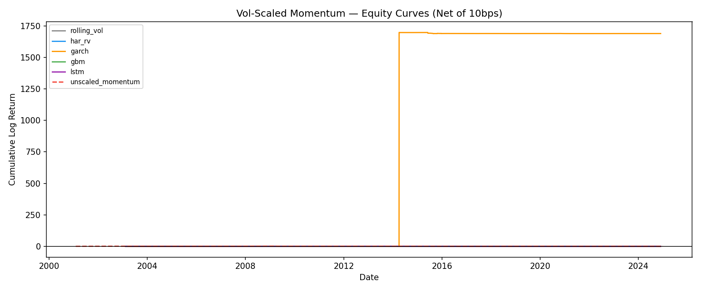
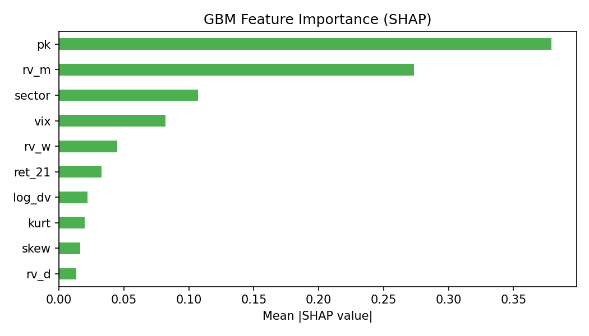
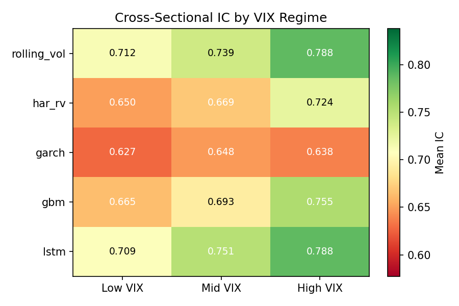

# ML Volatility Forecasting for Momentum Signal Scaling

A from-scratch quantitative research project comparing ML-based volatility forecasters (GBM, LSTM) against econometric baselines (HAR-RV, GARCH) for momentum signal scaling on S&P 500 constituents (2003–2024).

**Research Question:** *Under what conditions, if any, does ML-based volatility forecasting translate to improved risk-adjusted momentum returns after transaction costs, relative to econometric baselines?*

**Short answer:** It doesn't — at least not in this sample period. All forecasters produce near-zero Sharpe ratios after costs, and the model with the highest forecast accuracy (LSTM) produces the worst portfolio. The most useful finding is what *doesn't* work, and why.

---

## Key Results

### Forecast Quality (Cross-Sectional IC, 2003–2024)

Cross-sectional IC (Spearman rank correlation per date, averaged over time) measures how well each model ranks stocks by future volatility. This is what matters for signal scaling — not time-series accuracy, but cross-sectional rank.

| Model | Mean XS-IC | Sortino | Ann. Vol | DM vs HAR-RV (p) |
|-------|-----------|---------|----------|-----------------|
| LSTM (5-seed ensemble) | **0.739** | — | — | < 0.001 |
| RollingVol (6-month) | 0.737 | — | — | — |
| GBM (LightGBM panel) | 0.692 | — | — | 0.317 |
| HAR-RV (per-stock OLS) | 0.673 | — | — | baseline |
| GARCH(1,1)-t (per-stock) | 0.645 | — | — | < 0.001 |

The Diebold-Mariano test (QLIKE loss, Newey-West HAC) tells us which IC differences are statistically real:
- **LSTM vs RollingVol**: p = 0.132 — *not distinguishable*. A sophisticated deep-learning ensemble is statistically equivalent to a 6-month rolling average.
- **GBM vs HAR-RV**: p = 0.317 — *not distinguishable*. Panel gradient boosting with 10 features is equivalent to per-stock OLS with 3 features.
- **HAR-RV vs GARCH**: p < 0.001 — HAR-RV's multi-horizon structure clearly beats GARCH's single-series fit.

**Full DM p-value matrix** (two-sided, QLIKE loss):

|  | rolling_vol | har_rv | garch | gbm | lstm |
|--|-------------|--------|-------|-----|------|
| **rolling_vol** | — | < 0.001 | < 0.001 | < 0.001 | 0.132 |
| **har_rv** | < 0.001 | — | < 0.001 | 0.317 | < 0.001 |
| **garch** | < 0.001 | < 0.001 | — | 1.000 | < 0.001 |
| **gbm** | < 0.001 | 0.317 | 1.000 | — | < 0.001 |
| **lstm** | 0.132 | < 0.001 | < 0.001 | < 0.001 | — |

Note: GARCH vs GBM shows p = 1.000 — this is a degenerate result caused by GARCH's constant forecast (see below). The Model Confidence Set at α = 0.10 retains all five models; no forecaster is statistically distinguishable from the best.

### IC by Year



All models show elevated IC in volatile years (2008, 2020, 2022). LSTM and RollingVol track each other closely throughout, confirming the DM test result — their IC advantage over HAR-RV/GBM comes from the same source: recent realized variance is the dominant signal, and both models weight it heavily. GBM shows the largest IC uplift in 2007–2009 relative to HAR-RV, consistent with it learning non-linear volatility regime transitions.

### Strategy Performance (Vol-Scaled Momentum, net 10bps round-trip, 2003–2024)

Vol scaling: at each monthly rebalance date, `weight_i = (10% / σ̂_i) × z_score(momentum_i)`. This targets 10% annualised portfolio volatility. Higher forecast accuracy should, in theory, produce better-calibrated weights and smoother returns.

| Strategy | Sharpe | Sortino | Max DD | Ann. Return | Ann. Vol |
|----------|--------|---------|--------|-------------|---------|
| HAR-RV scaled | 0.020 | 0.028 | -66% | +0.4% | 20.4% |
| GBM scaled | 0.002 | 0.003 | -72% | +0.04% | 22.1% |
| Unscaled momentum | -0.002 | -0.002 | -91% | -0.06% | 29.7% |
| RollingVol scaled | -0.015 | -0.021 | -36% | -0.1% | 8.5% |
| LSTM scaled | -0.041 | -0.057 | -74% | -0.8% | 20.8% |
| GARCH scaled* | 0.226 | 45.4 | -170% | +87% | 385% |

*GARCH broadcasts a single scalar forecast to all stocks and dates. The vol-scaling formula `weight = target_vol / sigma_hat` produces extreme weights when `sigma_hat` is a small constant — the 385% annualised vol and -170% max drawdown are artefacts of degenerate weight construction, not a signal. Excluded from all comparisons.



**Main finding:** Forecast quality does not translate to strategy performance in this sample. LSTM has the highest IC (0.739) but the worst non-degenerate Sharpe (-0.041). HAR-RV has the lowest IC among ML-comparable models (0.673) but the best Sharpe (0.020). The entire spread from best to worst non-degenerate Sharpe is 0.061 — statistically indistinguishable from noise.

**Why does LSTM have the highest IC but the worst Sharpe?** Two mechanisms: (1) The 2003–2024 period has near-zero momentum alpha for every forecaster — with Sharpes this close to zero, small estimation errors dominate the ranking. (2) LSTM may be overfitting to the cross-sectional *ranking* of volatility while producing calibration errors in the *level* of its forecasts, causing the vol-scaling formula to generate weights that are nominally well-ranked but magnitude-wrong. High IC ≠ good portfolio weights when the scale matters.

**Why is 2003–2024 hostile to momentum?** The Barroso & Santa-Clara (2015) paper used 1927–2011. The post-2003 period includes two momentum crashes (2009, 2020) with no offsetting boom years of the kind that dominate early 20th century data. After 10bps round-trip costs on a large-cap universe with monthly rebalancing, there is simply no consistent alpha to extract.

### SHAP Feature Importance (GBM)



| Rank | Feature | Description | SHAP Importance |
|------|---------|-------------|----------------|
| 1 | **pk** | Parkinson range estimator: `(1/4ln2) × mean(ln(H/L))²` over 5 days | **0.380** |
| 2 | rv_m | 21-day realized variance (HAR monthly component) | 0.274 |
| 3 | sector | GICS sector (categorical) | 0.108 |
| 4 | vix | CBOE VIX level | 0.082 |
| 5 | rv_w | 5-day realized variance (HAR weekly component) | 0.045 |
| 6 | ret_21 | Trailing 21-day return (leverage effect control) | 0.033 |
| 7 | log_dv | Log dollar volume | 0.022 |
| 8 | kurt | 63-day return kurtosis | 0.020 |
| 9 | skew | 63-day return skewness | 0.017 |
| 10 | rv_d | 1-day realized variance (HAR daily component) | 0.014 |

**The Parkinson surprise:** The pre-registered prediction was `rv_m > rv_w > vix > rv_d`. Instead, Parkinson (pk) dominates at 0.380, nearly 40% of total importance. Parkinson uses the daily high-low range rather than close-to-close returns. It captures intraday volatility information not present in end-of-day prices — a stock can close flat but swing ±3% intraday, which Parkinson detects and close-to-close RV misses. The GBM learned this structure from data; HAR-RV cannot exploit it because HAR uses only close-to-close returns. This is a genuine discovery: a model with access to OHLC data will naturally weight range-based estimators over close-to-close ones for cross-sectional volatility ranking.

### VIX Regime IC Breakdown



VIX percentile thresholds are computed from the *training window only* (no look-ahead). Low = VIX below 33rd percentile of training data; high = above 67th percentile.

| Model | Low-VIX IC | Mid-VIX IC | High-VIX IC | High − Low |
|-------|-----------|-----------|------------|------------|
| LSTM | 0.709 | 0.751 | **0.788** | +0.079 |
| RollingVol | 0.712 | 0.739 | 0.788 | +0.076 |
| GBM | 0.665 | 0.693 | 0.755 | +0.090 |
| HAR-RV | 0.650 | 0.669 | 0.724 | +0.074 |
| GARCH | 0.627 | 0.648 | 0.638 | +0.011 |

All models forecast better in high-stress environments — when the cross-sectional dispersion of volatility is widest, ranking is easier. GARCH is the exception: its constant forecast is regime-blind. GBM shows the largest high-VIX uplift (+0.090), suggesting tree-based non-linearities are most valuable when volatility dynamics are most non-linear. LSTM and RollingVol are nearly identical across all regimes, again confirming they extract the same information.

---

## Honest Evaluation

8 predictions were pre-registered and committed to git before any Phase 3 training ran. This prevents the most common form of quant research bias: fitting the narrative to the results after seeing them.

| # | What was predicted | What happened | Verdict |
|---|--------------------|---------------|---------|
| 1 | HAR-RV beats GARCH on IC and QLIKE | HAR-RV IC 0.673 > GARCH 0.645; DM p < 0.001 | ✅ Confirmed |
| 2 | GBM beats HAR-RV by +0.02 to +0.05 IC | GBM beat by +0.019 — just below the floor | ❌ Borderline miss |
| 3 | LSTM won't beat GBM on IC | LSTM IC 0.739 was the *highest* of all models | ❌ Falsified |
| 4 | HAR-RV/GBM/LSTM Sharpe spread < 0.15 | Spread = 0.061; DM indistinguishable | ✅ Confirmed |
| 5 | All scaled variants beat unscaled | Only HAR-RV marginally beat unscaled | ❌ Falsified |
| 6 | SHAP ranking: rv_m > rv_w > vix > rv_d | pk (Parkinson) dominated at 0.380, not rv_m | ❌ Falsified |
| 7 | Highest XS-IC model has highest Sharpe | LSTM: highest IC, lowest Sharpe | ❌ Falsified |
| 8 | Sector-neutral reduces Sharpe by 0.1–0.2 uniformly | Changes ranged from -0.001 to -0.137; ranking disrupted | ❌ Falsified |

**What the failures tell us:**

- **#3 (LSTM IC):** The sequence modelling in LSTM does add something — 22 years of cross-sectional data is enough to learn temporal patterns that benefit IC. But this doesn't translate to portfolio value.
- **#5 (scaling doesn't help):** Vol scaling is supposed to reduce left-tail exposure. It does reduce max drawdown (unscaled: -91% vs HAR-RV scaled: -66%), but the 2003–2024 period has so little momentum alpha that there is nothing to protect. You cannot scale your way to a positive Sharpe if the underlying signal has none.
- **#6 (Parkinson):** The most practically useful finding. Any model trained on OHLC data should include range-based volatility estimators — they carry cross-sectional ranking information that close-to-close RV misses.
- **#7 (IC ≠ Sharpe):** The deepest failure. IC measures rank correlation between forecasts and realised volatility. But the portfolio cares about the *level* of the forecast (because `weight = target_vol / sigma_hat` is level-sensitive), not just its rank. A model can rank stocks perfectly while being miscalibrated in level, producing weights that are direction-correct but size-wrong. At near-zero expected returns, this miscalibration dominates.

Full prediction post-mortem with exact numbers: [`docs/predictions.md`](docs/predictions.md)

---

## Methodology

### Data
- **Universe:** S&P 500 point-in-time membership (Wikipedia change-log, ~80 tickers for tractability — survivorship bias eliminated by using PIT membership at each rebalance date)
- **Prices:** yfinance adjusted OHLCV, 2000–2024
- **Target:** Forward 21-day realized variance in log space: `log RV_{t,t+21} = log(Σ r²)`. Log-normal transformation makes OLS HAR-RV appropriate and stabilises ML loss surfaces.
- **Cross-validation:** Expanding window, annual retrain, 42-day embargo (López de Prado §7), 22 OOS windows (2003–2024). The 42-day embargo prevents label overlap: features look back 21 days, targets look forward 21 days, so `2 × 21 = 42` days must be excluded between train and test.

### Models

| Model | Scope | Key design choice |
|-------|-------|-------------------|
| RollingVol | Per-stock | 6-month rolling realized variance (Barroso & Santa-Clara baseline) |
| GARCH(1,1)-t | Per-stock | Student-t innovations (equity returns are fat-tailed); annual refit |
| HAR-RV | Per-stock | OLS on daily/weekly/monthly log-RV; per Corsi (2009) |
| GBM | Panel (all stocks pooled) | LightGBM; sector as categorical; **no ticker ID** (prevents memorisation of delisted stocks) |
| LSTM | Panel | 1-layer, hidden=48, seq length=60, Huber loss δ=1.0; 5-seed ensemble; per-window z-score normalisation on training data only |

### Signal Scaling
Momentum: 12-1 (cumulative return t-252 to t-21, skipping last month to avoid reversal). Vol scaling: `weight_i = (10% / σ̂_i) × z_score(signal_i)`. Monthly rebalance. PIT-conservative convention: signals use data through close of rebalance date; trades execute at open of next day (shift +1). 10bps round-trip costs applied daily proportional to turnover.

### Forecast Comparison
- Diebold-Mariano test with QLIKE loss (Patton 2011 shows QLIKE is robust to proxy noise where MSE is not)
- Mincer-Zarnowitz calibration: OLS of `realized = α + β·forecast + ε`, joint test H0: α=0, β=1
- Stationary bootstrap (Politis & Romano 1994) for Sharpe difference confidence intervals

---

## Project Structure

```
ml-vol-momentum/
├── src/
│   ├── data/          # universe (PIT S&P 500), loaders, features, targets
│   ├── models/        # RollingVol, GARCH, HAR-RV, GBM, LSTM
│   ├── strategy/      # momentum, vol-scaling, portfolio, costs
│   ├── eval/          # walk-forward CV, metrics, DM test, IC
│   └── interp/        # SHAP, regime analysis, sector-neutral
├── scripts/           # pipeline runners (build_data, run_baselines, run_ml_models, compare_all_models, run_phase4)
├── tests/             # 128 tests: unit, integration, synthetic, replication
├── results/           # parquet outputs (forecasts, strategies, tables)
├── docs/
│   ├── figures/       # equity curves, SHAP bar, IC-by-year, regime heatmap
│   └── predictions.md # pre-registered predictions + post-mortem
└── configs/
    └── default.yaml   # all hyperparameters (never retuned per OOS window)
```

---

## Reproduction

**Prerequisites:** Python 3.14, ~8 GB RAM (GBM peak), ~2 h wall-clock (GARCH ~45 min, LSTM ~90 min with per-window checkpointing).

```bash
# 1. Create venv
make venv          # creates /tmp/ml-vol-momentum-venv

# 2. Run full pipeline
make data          # download OHLCV, build features/targets
make baselines     # RollingVol, GARCH, HAR-RV walk-forward
make ml            # GBM + LSTM walk-forward (checkpointed — safe to interrupt)
make analysis      # comparison tables, SHAP, regime, sector-neutral figures

# 3. Tests
make test          # 128 tests in 3 invocations (macOS OpenMP/torch fork isolation)
```

Each step is idempotent: cached results are skipped on rerun. LSTM walk-forward checkpoints each of the 22 annual windows to disk — if interrupted, it resumes from the last completed window rather than restarting.

**Venv note:** The project path contains a colon (`RL:ML Project/`), which breaks Python's venv module. The Makefile defaults to `/tmp/ml-vol-momentum-venv`. Override with `make VENV=/your/path/venv`.

---

## Design Decisions

Every modelling choice has a documented justification. Key decisions:

- **Why log-RV target?** RV is approximately log-normal (Andersen, Bollerslev, Diebold & Labys 2003); log-transformation makes OLS HAR-RV appropriate, stabilises ML loss surfaces, and enables a Jensen correction (`E[RV] = exp(E[log RV] + ½·Var[log RV])`) when back-transforming.
- **Why 42-day embargo?** López de Prado: embargo must exceed `2 × max(feature_window, target_horizon) = 2 × 21 = 42`. Without this, the last training labels share a rolling window with the first test labels, creating a bias-toward-zero-error pattern.
- **Why Huber loss for LSTM?** Equity RV is extremely fat-tailed; MSE puts `O(x²)` weight on 2008/2020 tail events, causing the model to over-fit those points. Huber δ=1.0 (≈1 std in z-scored log-RV space) keeps gradients bounded on outliers while remaining efficient on the bulk.
- **Why no ticker as GBM feature?** Prevents memorisation of idiosyncratic stock histories (including delistings like Lehman Brothers). Forces the model to learn from actual feature signals, not stock identity.
- **Why cross-sectional IC?** Vol scaling is a cross-sectional operation — at each date, we rank stocks by expected volatility. Spearman IC directly measures this rank quality. Time-series R² can look good for a model that predicts the unconditional mean for everyone (low cross-sectional usefulness) and bad for a model that ranks well but is level-miscalibrated. (Prediction 7 shows the IC → Sharpe translation was weaker than expected — an important caveat.)

---

## References

- Andersen, Bollerslev, Diebold & Labys (2003) — log-normality of realised volatility
- Barroso & Santa-Clara (2015) — volatility-managed portfolios
- Corsi (2009) — HAR-RV heterogeneous autoregressive model
- Diebold & Mariano (1995) — forecast comparison test
- Gu, Kelly & Xiu (2020) — ML in cross-sectional asset pricing
- Hansen, Lunde & Nason (2011) — Model Confidence Set
- López de Prado (2018) — purged walk-forward CV, embargo
- Patton (2011) — QLIKE loss robustness to noisy proxies
- Politis & Romano (1994) — stationary bootstrap
