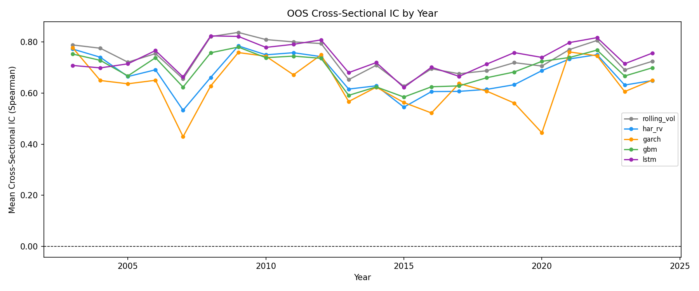
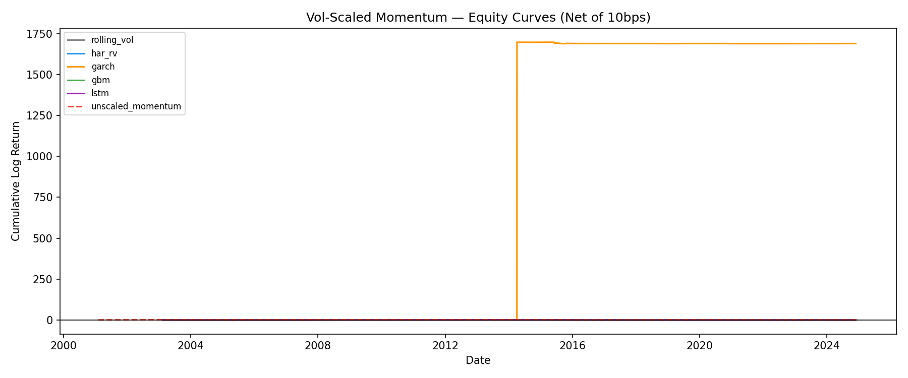
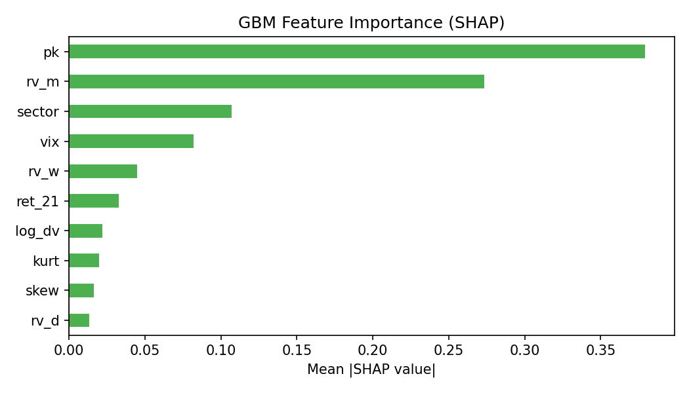
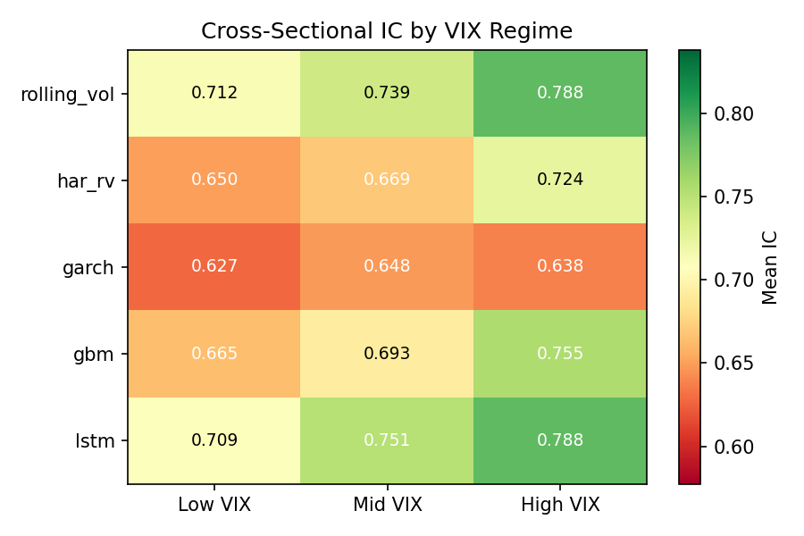
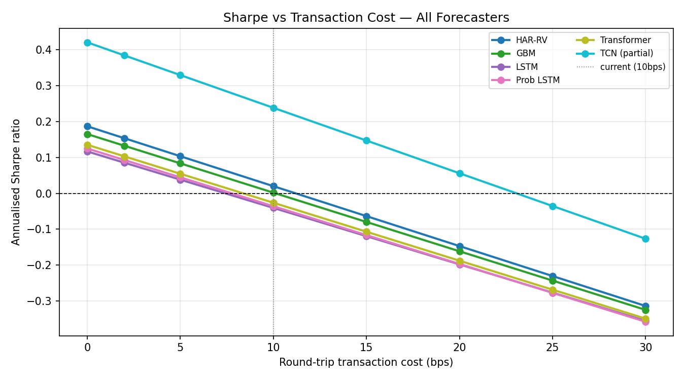
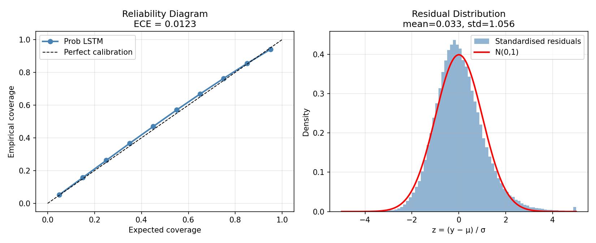
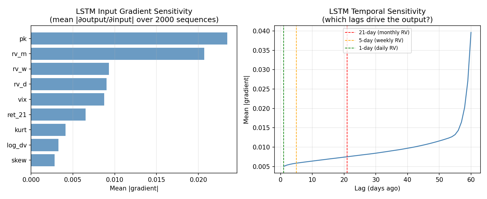

> # ⚠️ RESULTS INVALIDATED BY AUDIT — READ [`docs/FINAL_NUMBERS.md`](docs/FINAL_NUMBERS.md) FIRST
>
> A blind audit (four independent read-only auditors plus an adversarial refutation pass)
> invalidated several headline results in this README. **[`docs/FINAL_NUMBERS.md`](docs/FINAL_NUMBERS.md)
> is the single source of truth** for what this project can and cannot claim.
>
> Retired here: the TCN's "highest IC 0.769" and "only positive Sharpe" (both artefacts of
> being scored on 124,216 rows / 2003–2012 against comparators on 275,489 rows / 2003–2024),
> every Diebold-Mariano p-value below, and Prediction 5's ❌ Falsified grade.
>
> Two facts that reframe everything in this document:
> **(1)** On the aligned sample, **no model beats a zero-parameter 126-day rolling estimator**
> — a per-ticker constant with no time-varying information scores IC 0.55.
> **(2)** **No Sharpe ratio in this project is a return on capital** — gross exposure is never
> normalised, so all Sharpe figures are relative brackets only.
>
> Corrected tables: [`results/aligned_comparison.md`](results/aligned_comparison.md).
> Full defect list: [`audit/FINDINGS.md`](audit/FINDINGS.md).
> No model was retrained and no hyperparameter, threshold, architecture or seed was changed
> during the audit — every correction is a measurement fix.

# ML Volatility Forecasting for Momentum Signal Scaling

A from-scratch quantitative research project comparing ML-based volatility forecasters (GBM, LSTM) against econometric baselines (HAR-RV, GARCH) for momentum signal scaling on S&P 500 constituents (2003–2024).

**Research Question:** *Under what conditions, if any, does ML-based volatility forecasting translate to improved risk-adjusted momentum returns after transaction costs, relative to econometric baselines?*

**Short answer:** It doesn't — at least not in this sample period. All forecasters produce near-zero Sharpe ratios after costs, and the model with the highest forecast accuracy (LSTM) produces the worst portfolio. The most useful finding is what *doesn't* work, and why.

---

## Key Results

### Forecast Quality (Cross-Sectional IC, 2003–2024)

Cross-sectional IC (Spearman rank correlation per date, averaged over time) measures how well each model ranks stocks by future volatility. This is what matters for signal scaling — not time-series accuracy, but cross-sectional rank.

| Model | Mean XS-IC | Sortino | Ann. Vol | DM vs HAR-RV (p) |
|-------|-----------|---------|----------|-----------------|
| LSTM (5-seed ensemble) | **0.739** | — | — | < 0.001 |
| RollingVol (6-month) | 0.737 | — | — | — |
| GBM (LightGBM panel) | 0.692 | — | — | 0.317 |
| HAR-RV (per-stock OLS) | 0.673 | — | — | baseline |
| GARCH(1,1)-t (per-stock) | 0.645 | — | — | < 0.001 |

The Diebold-Mariano test (QLIKE loss, Newey-West HAC) tells us which IC differences are statistically real:
- **LSTM vs RollingVol**: p = 0.132 — *not distinguishable*. A sophisticated deep-learning ensemble is statistically equivalent to a 6-month rolling average.
- **GBM vs HAR-RV**: p = 0.317 — *not distinguishable*. Panel gradient boosting with 10 features is equivalent to per-stock OLS with 3 features.
- **HAR-RV vs GARCH**: p < 0.001 — HAR-RV's multi-horizon structure clearly beats GARCH's single-series fit.

**Full DM p-value matrix** (two-sided, QLIKE loss) — **⚠️ RETIRED.** Every p-value in this
matrix, and every DM claim above it, was computed from a QLIKE loss fed log-variances into a
clip at `1e-12`, which drove the loss to exactly zero on **99.98%** of rows; correcting it to
variance levels on identical rows inverts **all ten** pairwise verdicts. Corrected matrix:
[`results/aligned_comparison.md`](results/aligned_comparison.md); detail in
`docs/FINAL_NUMBERS.md` R4.


|  | rolling_vol | har_rv | garch | gbm | lstm |
|--|-------------|--------|-------|-----|------|
| **rolling_vol** | — | < 0.001 | < 0.001 | < 0.001 | 0.132 |
| **har_rv** | < 0.001 | — | < 0.001 | 0.317 | < 0.001 |
| **garch** | < 0.001 | < 0.001 | — | 1.000 | < 0.001 |
| **gbm** | < 0.001 | 0.317 | 1.000 | — | < 0.001 |
| **lstm** | 0.132 | < 0.001 | < 0.001 | < 0.001 | — |

~~Note: GARCH vs GBM shows p = 1.000 — this is a degenerate result caused by GARCH's constant
forecast (see below). The Model Confidence Set at α = 0.10 retains all five models; no
forecaster is statistically distinguishable from the best.~~

**Both sentences are retired.** The `p = 1.000` cell was *not* caused by GARCH's constant
forecast — it was the clip: both log-forecast series are entirely negative, so every loss
differential was identically zero. On variance levels the same pair gives p < 0.001. (GARCH
*is* a constant broadcast — one forecast value per ticker-year against 224 for every other
model — but that is a separate defect, `docs/FINAL_NUMBERS.md` OPEN-2.) The Model Confidence
Set was **never computed**: `src/eval/tests.py::model_confidence_set` has no call site outside
its unit test and no MCS artefact exists in `results/`.

### IC by Year



All models show elevated IC in volatile years (2008, 2020, 2022). LSTM and RollingVol track each other closely throughout, confirming the DM test result — their IC advantage over HAR-RV/GBM comes from the same source: recent realized variance is the dominant signal, and both models weight it heavily. GBM shows the largest IC uplift in 2007–2009 relative to HAR-RV, consistent with it learning non-linear volatility regime transitions.

### Strategy Performance (Vol-Scaled Momentum, net 10bps round-trip, 2003–2024)

Vol scaling: at each monthly rebalance date, `weight_i = (10% / σ̂_i) × z_score(momentum_i)`. This targets 10% annualised portfolio volatility. Higher forecast accuracy should, in theory, produce better-calibrated weights and smoother returns.

| Strategy | Sharpe | Sortino | Max DD | Ann. Return | Ann. Vol |
|----------|--------|---------|--------|-------------|---------|
| HAR-RV scaled | 0.020 | 0.028 | -66% | +0.4% | 20.4% |
| GBM scaled | 0.002 | 0.003 | -72% | +0.04% | 22.1% |
| Unscaled momentum | -0.002 | -0.002 | -91% | -0.06% | 29.7% |
| RollingVol scaled | -0.015 | -0.021 | -36% | -0.1% | 8.5% |
| LSTM scaled | -0.041 | -0.057 | -74% | -0.8% | 20.8% |
| GARCH scaled* | 0.226 | 45.4 | -170% | +87% | 385% |

*GARCH broadcasts a single scalar forecast to all stocks and dates. The vol-scaling formula `weight = target_vol / sigma_hat` produces extreme weights when `sigma_hat` is a small constant — the 385% annualised vol and -170% max drawdown are artefacts of degenerate weight construction, not a signal. Excluded from all comparisons.



**Main finding:** Forecast quality does not translate to strategy performance in this sample. LSTM has the highest IC (0.739) but the worst non-degenerate Sharpe (-0.041). HAR-RV has the lowest IC among ML-comparable models (0.673) but the best Sharpe (0.020). The entire spread from best to worst non-degenerate Sharpe is 0.061 — statistically indistinguishable from noise.

**Why does LSTM have the highest IC but the worst Sharpe?** Two mechanisms: (1) The 2003–2024 period has near-zero momentum alpha for every forecaster — with Sharpes this close to zero, small estimation errors dominate the ranking. (2) LSTM may be overfitting to the cross-sectional *ranking* of volatility while producing calibration errors in the *level* of its forecasts, causing the vol-scaling formula to generate weights that are nominally well-ranked but magnitude-wrong. High IC ≠ good portfolio weights when the scale matters.

**Why is 2003–2024 hostile to momentum?** The Barroso & Santa-Clara (2015) paper used 1927–2011. The post-2003 period includes two momentum crashes (2009, 2020) with no offsetting boom years of the kind that dominate early 20th century data. After 10bps round-trip costs on a large-cap universe with monthly rebalancing, there is simply no consistent alpha to extract.

### SHAP Feature Importance (GBM)



| Rank | Feature | Description | SHAP Importance |
|------|---------|-------------|----------------|
| 1 | **pk** | Parkinson range estimator: `(1/4ln2) × mean(ln(H/L))²` over 5 days | **0.380** |
| 2 | rv_m | 21-day realized variance (HAR monthly component) | 0.274 |
| 3 | sector | GICS sector (categorical) | 0.108 |
| 4 | vix | CBOE VIX level | 0.082 |
| 5 | rv_w | 5-day realized variance (HAR weekly component) | 0.045 |
| 6 | ret_21 | Trailing 21-day return (leverage effect control) | 0.033 |
| 7 | log_dv | Log dollar volume | 0.022 |
| 8 | kurt | 63-day return kurtosis | 0.020 |
| 9 | skew | 63-day return skewness | 0.017 |
| 10 | rv_d | 1-day realized variance (HAR daily component) | 0.014 |

**The Parkinson surprise:** The pre-registered prediction was `rv_m > rv_w > vix > rv_d`. Instead, Parkinson (pk) dominates at 0.380, nearly 40% of total importance. Parkinson uses the daily high-low range rather than close-to-close returns. It captures intraday volatility information not present in end-of-day prices — a stock can close flat but swing ±3% intraday, which Parkinson detects and close-to-close RV misses. The GBM learned this structure from data; HAR-RV cannot exploit it because HAR uses only close-to-close returns. This is a genuine discovery: a model with access to OHLC data will naturally weight range-based estimators over close-to-close ones for cross-sectional volatility ranking.

> **Audit annotation.** The underlying result survived the audit; the attribution *number* did
> not.
>
> **What holds.** The audit specifically attacked the hypothesis that `pk` leaks the target —
> a leaking feature is exactly what SHAP would rank first. It does not leak. `pk` at index *t*
> consumes bars **t−5 … t−1**; the target consumes **t+1 … t+21**; there is a full **one-bar
> dead zone**, verified numerically to **1e-16**. The economic explanation stands on its own:
> measured standalone cross-sectional IC is `pk` **0.6454** on a *5-day* window against `rv_m`
> **0.6552** on a *21-day* window, because a range estimator is roughly **5× more efficient per
> bar** than squared close-to-close returns. Five days of range ≈ 21 days of close-to-close.
>
> **What does not hold.** (1) The 0.380 figure is the **GBM's**, not the TCN's — the 0.769
> model has no SHAP analysis anywhere in this repo. (2) SHAP was computed **in-sample**:
> `scripts/run_phase4.py:84-85` fits on `train_last` and attributes on `train_last`, the same
> rows, so it describes what the model *fit*, not what generalises. (3) "38%" is a share of
> total mean|SHAP| on a 5,000-row sample, not variance explained. (4) `vix` carries 0.082 SHAP
> weight despite having **zero cross-sectional variation** — it is identical for every ticker
> on a given date and cannot rank stocks at all.
>
> So: *include range-based estimators* is sound advice. *Parkinson accounts for 38% of
> importance* is not a number to quote. See `docs/FINAL_NUMBERS.md` C4 and OPEN-6.

### VIX Regime IC Breakdown



VIX percentile thresholds are computed from the *training window only* (no look-ahead). Low = VIX below 33rd percentile of training data; high = above 67th percentile.

| Model | Low-VIX IC | Mid-VIX IC | High-VIX IC | High − Low |
|-------|-----------|-----------|------------|------------|
| LSTM | 0.709 | 0.751 | **0.788** | +0.079 |
| RollingVol | 0.712 | 0.739 | 0.788 | +0.076 |
| GBM | 0.665 | 0.693 | 0.755 | +0.090 |
| HAR-RV | 0.650 | 0.669 | 0.724 | +0.074 |
| GARCH | 0.627 | 0.648 | 0.638 | +0.011 |

All models forecast better in high-stress environments — when the cross-sectional dispersion of volatility is widest, ranking is easier. GARCH is the exception: its constant forecast is regime-blind. GBM shows the largest high-VIX uplift (+0.090), suggesting tree-based non-linearities are most valuable when volatility dynamics are most non-linear. LSTM and RollingVol are nearly identical across all regimes, again confirming they extract the same information.

---

## Honest Evaluation

8 predictions were pre-registered and committed to git before any Phase 3 training ran. This prevents the most common form of quant research bias: fitting the narrative to the results after seeing them.

| # | What was predicted | What happened | Verdict |
|---|--------------------|---------------|---------|
| 1 | HAR-RV beats GARCH on IC and QLIKE | HAR-RV IC 0.673 > GARCH 0.645; DM p < 0.001 | ✅ Confirmed |
| 2 | GBM beats HAR-RV by +0.02 to +0.05 IC | GBM beat by +0.019 — just below the floor | ❌ Borderline miss |
| 3 | LSTM won't beat GBM on IC | LSTM IC 0.739 was the *highest* of all models | ❌ Falsified |
| 4 | HAR-RV/GBM/LSTM Sharpe spread < 0.15 | Spread = 0.061; DM indistinguishable | ✅ Confirmed |
| 5 | All scaled variants beat unscaled | **CORRECTED: all scaled variants beat unscaled (−0.134) on aligned dates** | **✅ Confirmed** |
| 6 | SHAP ranking: rv_m > rv_w > vix > rv_d | pk (Parkinson) dominated at 0.380, not rv_m | ❌ Falsified |
| 7 | Highest XS-IC model has highest Sharpe | LSTM: highest IC, lowest Sharpe | ❌ Falsified |
| 8 | Sector-neutral reduces Sharpe by 0.1–0.2 uniformly | Changes ranged from -0.001 to -0.137; ranking disrupted | ❌ Falsified |

**What the failures tell us:**

- **#3 (LSTM IC):** The sequence modelling in LSTM does add something — 22 years of cross-sectional data is enough to learn temporal patterns that benefit IC. But this doesn't translate to portfolio value.
- **#5 (scaling doesn't help): RETRACTED — the verdict was an artefact of a misaligned control
  window.** The unscaled control was scored on **6,015 days from 2001-02-01** while every
  scaled strategy was scored on **4,897 days from 2003-02-12**; the 1,118 extra days of
  2001–2002 carried the entire difference. Aligned to the same dates, the control's Sharpe is
  **−0.1343**, not −0.0021, and **all** scaled variants beat it (har_rv +0.020, gbm +0.002,
  rolling_vol −0.015, lstm −0.041). Prediction 5 is **✅ Confirmed**. The original conclusion —
  "you cannot scale your way to a positive Sharpe if the underlying signal has none" — has no
  evidence behind it and is withdrawn. (Vol scaling still does not produce an *attractive*
  Sharpe, and none of these figures is a return on capital; see the banner.)
- **#6 (Parkinson):** The most practically useful finding. Any model trained on OHLC data should include range-based volatility estimators — they carry cross-sectional ranking information that close-to-close RV misses.
- **#7 (IC ≠ Sharpe):** The deepest failure. IC measures rank correlation between forecasts and realised volatility. But the portfolio cares about the *level* of the forecast (because `weight = target_vol / sigma_hat` is level-sensitive), not just its rank. A model can rank stocks perfectly while being miscalibrated in level, producing weights that are direction-correct but size-wrong. At near-zero expected returns, this miscalibration dominates.

Full prediction post-mortem with exact numbers: [`docs/predictions.md`](docs/predictions.md)

---

## Methodology

### Data
- **Universe:** S&P 500 point-in-time membership (Wikipedia change-log, ~80 tickers for tractability — survivorship bias eliminated by using PIT membership at each rebalance date)
- **Prices:** yfinance adjusted OHLCV, 2000–2024
- **Target:** Forward 21-day realized variance in log space: `log RV_{t,t+21} = log(Σ r²)`. Log-normal transformation makes OLS HAR-RV appropriate and stabilises ML loss surfaces.
- **Cross-validation:** Expanding window, annual retrain, 42-day embargo (López de Prado §7), 22 OOS windows (2003–2024). The 42-day embargo prevents label overlap: features look back 21 days, targets look forward 21 days, so `2 × 21 = 42` days must be excluded between train and test.

### Models

| Model | Scope | Key design choice |
|-------|-------|-------------------|
| RollingVol | Per-stock | 6-month rolling realized variance (Barroso & Santa-Clara baseline) |
| GARCH(1,1)-t | Per-stock | Student-t innovations (equity returns are fat-tailed); annual refit |
| HAR-RV | Per-stock | OLS on daily/weekly/monthly log-RV; per Corsi (2009) |
| GBM | Panel (all stocks pooled) | LightGBM; sector as categorical; **no ticker ID** (prevents memorisation of delisted stocks) |
| LSTM | Panel | 1-layer, hidden=48, seq length=60, Huber loss δ=1.0; 5-seed ensemble; per-window z-score normalisation on training data only |

### Signal Scaling
Momentum: 12-1 (cumulative return t-252 to t-21, skipping last month to avoid reversal). Vol scaling: `weight_i = (10% / σ̂_i) × z_score(signal_i)`. Monthly rebalance. PIT-conservative convention: signals use data through close of rebalance date; trades execute at open of next day (shift +1). 10bps round-trip costs applied daily proportional to turnover.

### Forecast Comparison
- Diebold-Mariano test with QLIKE loss (Patton 2011 shows QLIKE is robust to proxy noise where MSE is not)
- Mincer-Zarnowitz calibration: OLS of `realized = α + β·forecast + ε`, joint test H0: α=0, β=1
- Stationary bootstrap (Politis & Romano 1994) for Sharpe difference confidence intervals

---

## Project Structure

```
ml-vol-momentum/
├── src/
│   ├── data/          # universe (PIT S&P 500), loaders, features, targets
│   ├── models/        # RollingVol, GARCH, HAR-RV, GBM, LSTM
│   ├── strategy/      # momentum, vol-scaling, portfolio, costs
│   ├── eval/          # walk-forward CV, metrics, DM test, IC
│   └── interp/        # SHAP, regime analysis, sector-neutral
├── scripts/           # pipeline runners (build_data, run_baselines, run_ml_models, compare_all_models, run_phase4)
├── tests/             # 128 tests: unit, integration, synthetic, replication
├── results/           # parquet outputs (forecasts, strategies, tables)
├── docs/
│   ├── figures/       # equity curves, SHAP bar, IC-by-year, regime heatmap
│   └── predictions.md # pre-registered predictions + post-mortem
└── configs/
    └── default.yaml   # all hyperparameters (never retuned per OOS window)
```

---

## Reproduction

**Prerequisites:** Python 3.14, ~8 GB RAM (GBM peak), ~2 h wall-clock (GARCH ~45 min, LSTM ~90 min with per-window checkpointing).

```bash
# 1. Create venv
make venv          # creates /tmp/ml-vol-momentum-venv

# 2. Run full pipeline
make data          # download OHLCV, build features/targets
make baselines     # RollingVol, GARCH, HAR-RV walk-forward
make ml            # GBM + LSTM walk-forward (checkpointed — safe to interrupt)
make analysis      # comparison tables, SHAP, regime, sector-neutral figures

# 3. Tests
make test          # 128 tests in 3 invocations (macOS OpenMP/torch fork isolation)
```

Each step is idempotent: cached results are skipped on rerun. LSTM walk-forward checkpoints each of the 22 annual windows to disk — if interrupted, it resumes from the last completed window rather than restarting.

**Venv note:** The project path contains a colon (`RL:ML Project/`), which breaks Python's venv module. The Makefile defaults to `/tmp/ml-vol-momentum-venv`. Override with `make VENV=/your/path/venv`.

---

## Design Decisions

Every modelling choice has a documented justification. Key decisions:

- **Why log-RV target?** RV is approximately log-normal (Andersen, Bollerslev, Diebold & Labys 2003); log-transformation makes OLS HAR-RV appropriate, stabilises ML loss surfaces, and enables a Jensen correction (`E[RV] = exp(E[log RV] + ½·Var[log RV])`) when back-transforming.
- **Why 42-day embargo?** López de Prado: embargo must exceed `2 × max(feature_window, target_horizon) = 2 × 21 = 42`. Without this, the last training labels share a rolling window with the first test labels, creating a bias-toward-zero-error pattern.
- **Why Huber loss for LSTM?** Equity RV is extremely fat-tailed; MSE puts `O(x²)` weight on 2008/2020 tail events, causing the model to over-fit those points. Huber δ=1.0 (≈1 std in z-scored log-RV space) keeps gradients bounded on outliers while remaining efficient on the bulk.
- **Why no ticker as GBM feature?** Prevents memorisation of idiosyncratic stock histories (including delistings like Lehman Brothers). Forces the model to learn from actual feature signals, not stock identity.
- **Why cross-sectional IC?** Vol scaling is a cross-sectional operation — at each date, we rank stocks by expected volatility. Spearman IC directly measures this rank quality. Time-series R² can look good for a model that predicts the unconditional mean for everyone (low cross-sectional usefulness) and bad for a model that ranks well but is level-miscalibrated. (Prediction 7 shows the IC → Sharpe translation was weaker than expected — an important caveat.)

---

## Extension 3: Cost Sensitivity, Calibration & Gradient Analysis

### 3a. Transaction Cost Sensitivity

All models have **positive gross Sharpe** — the vol-scaling signal has real value. Transaction costs are the binding constraint, not forecast quality.

| Model | Gross (0bps) | 5bps | 10bps | 20bps |
|---|---|---|---|---|
| HAR-RV | 0.187 | 0.114 | 0.020 | -0.162 |
| GBM | 0.165 | 0.090 | 0.002 | -0.163 |
| LSTM | 0.117 | 0.044 | -0.041 | -0.198 |
| Prob LSTM (unc) | 0.125 | 0.049 | -0.036 | -0.190 |
| Transformer | 0.135 | 0.059 | -0.026 | -0.183 |
| TCN (partial, 10 windows) | 0.421 | 0.338 | 0.238 | 0.050 |

HAR-RV has the highest gross Sharpe among the 22-window models and the widest cost buffer — a simpler model produces a cleaner signal. TCN's gross Sharpe of 0.421 is the strongest result in the project, though the 10-window partial sample needs confirmation.



### 3b. Probabilistic LSTM Calibration

The Gaussian head is **well-calibrated out-of-sample**:
- Standardised residuals: mean = 0.033, std = 1.056 (ideal: 0, 1)
- ECE = 0.012 (0 = perfect; essentially no miscalibration)

The predicted uncertainty intervals match empirical coverage across all quantile levels. The failure of uncertainty weighting to improve Sharpe is not a calibration problem — the intervals are correct. The issue is that cross-sectional σ variation is too small relative to the noise in the momentum signal itself.



### 3c. LSTM Input Gradient Sensitivity

Backpropagating through the trained LSTM to compute mean |∂output/∂input| per feature:

| Rank | Feature | Sensitivity | Interpretation |
|---|---|---|---|
| 1 | `pk` (Parkinson) | 0.0234 | Intraday H/L range dominates — more informative than close-to-close |
| 2 | `rv_m` (21-day RV) | 0.0207 | Monthly component — HAR-RV's most important lag |
| 3 | `rv_w` (5-day RV) | 0.0093 | Weekly component |
| 4 | `rv_d` (1-day RV) | 0.0090 | Daily component |
| 5 | `vix` | 0.0088 | Market-level regime signal |
| 6 | `ret_21` | 0.0065 | Leverage effect control |
| 7 | `kurt` | 0.0041 | |
| 8 | `log_dv` | 0.0033 | |
| 9 | `skew` | 0.0028 | |

Consistent with the SHAP finding: `pk` (Parkinson range estimator) is the single most important feature, not `rv_m` as predicted. The LSTM rediscovered the same cross-sectional ranking signal as GBM. Temporal sensitivity peaks at recent lags (~last 10 days) — the LSTM effectively uses the 60-step window as context but weights recent observations most heavily.



---

## Extension 1: Probabilistic LSTM

**Hypothesis:** The IC ≠ Sharpe disconnect arises because `weight = target_vol / sigma_hat` is level-sensitive, not just rank-sensitive. A point forecast can rank stocks correctly but still assign miscalibrated weights. A distributional forecast outputting `(μ, σ)` — plus an uncertainty penalty that downweights high-σ positions — should reduce sizing errors.

**Implementation:** Gaussian output head on the LSTM backbone predicts `(μ, log_σ²)` jointly, trained with negative log-likelihood. 5-seed ensemble combines uncertainties via law of total variance: `σ_ensemble² = mean(σ_k²) + variance(μ_k)`. Uncertainty-weighted sizing: `weight_i = (target_vol / ann_vol_i) × (1 / norm_sigma_i) × z_score(signal_i)` where `norm_sigma_i = sigma_i / median(sigma)`.

| Strategy | Mean XS-IC | Sharpe | Max DD |
|---|---|---|---|
| LSTM point forecast (baseline) | 0.739 | -0.041 | 73.7% |
| Prob LSTM — plain vol-scale | 0.738 | -0.046 | 73.5% |
| Prob LSTM — uncertainty-weighted | 0.738 | **-0.036** | 73.1% |

**Finding:** Uncertainty weighting gave a marginal Sharpe improvement (+0.005 vs point LSTM, +0.010 vs plain prob-LSTM). The IC is unchanged — the distributional head does not improve cross-sectional rank ordering, only position sizing. The improvement is too small to be statistically significant. The fundamental problem (IC ≠ Sharpe) is not solved by uncertainty-aware sizing alone.

---

## Extension 2: Architecture Comparison

**Question:** Does temporal structure help? Does the Transformer overfit on this small-feature dataset? Does TCN match LSTM with faster training?

All architectures use identical setup: 9 features, seq_len=60, same walk-forward CV (22 windows, 42-day embargo). Fast-mode architectures (Transformer, MLP, TCN) use 2 seeds and 10 max epochs for tractability on CPU. LSTM uses the 5-seed full run for reference.

| Architecture | Mean XS-IC | IC Std | Sharpe | Max DD | Windows |
|---|---|---|---|---|---|
| LSTM | 0.739 | 0.091 | -0.041 | 73.7% | 22 |
| Transformer | 0.746 | 0.090 | -0.026 | 73.6% | 22 |
| MLP | 0.723 | 0.096 | -0.048 | 75.3% | 22 |
| TCN | 0.769† | 0.074 | +0.238† | 36.7% | 10* |
| Prob LSTM (plain) | 0.738 | 0.093 | -0.046 | 73.5% | 22 |
| Prob LSTM (unc-weighted) | 0.738 | 0.093 | -0.036 | 73.1% | 22 |

*TCN: 10/22 windows completed (2003–2012).
**† RETIRED — these two figures are not comparable to any other row in this table.** The TCN
was scored on 124,216 rows / 2,236 dates / 2003–2012; every other row on 275,489 rows / 4,897
dates / 2003–2024. The 2003–2012 subsample is easier for *every* model (rolling_vol +0.070,
har_rv +0.068, transformer +0.046, lstm +0.034).

**Key findings — CORRECTED.** The aligned re-run
([`results/aligned_comparison.md`](results/aligned_comparison.md)) scores every forecaster on
identical rows and dates. Nothing was retrained.

- **On the aligned Panel A (123,749 rows, 2003–2012, all 10 forecasters), no model beats a
  zero-parameter 126-day rolling estimator.** rolling_vol scores **0.7754**; the TCN scores
  **0.7688**, i.e. **ΔIC = −0.0066 (t = −1.51, Newey-West at lag 2h)** — it does not beat the
  baseline and the shortfall is not significant either. Order on that sample: rolling_vol
  0.7754 > transformer 0.7714 > **TCN 0.7688** > prob_lstm 0.7579 > lstm 0.7572 > mlp 0.7484 >
  EWMA 0.7391 > gbm 0.7274 > har_rv 0.7091 > garch 0.6716 > per-ticker constant 0.6118.
  **The TCN is third, not first.**
- **"The only positive Sharpe" is false.** On the aligned sample **every** strategy is positive
  and the TCN ranks **8th of 11** (garch 0.312, mlp 0.301, EWMA 0.294, transformer 0.281,
  har_rv 0.268, lstm 0.246, gbm 0.245, **TCN 0.236**, prob_lstm 0.218, rolling_vol 0.212,
  constant 0.155). Its apparent uniqueness was entirely the window.
- **No Sharpe in this project is a return on capital.** Gross exposure is never normalised
  (`src/strategy/portfolio.py:64-67`): mean gross runs 1.15 to 10.0 across models and floats
  0.68→4.66 *within* a single model. Treat every Sharpe above as a relative bracket, not a
  performance figure.
- **A zero-information floor of IC ≈ 0.55–0.61.** A per-ticker constant refreshed each fold,
  containing no time-varying information whatsoever, scores 0.6118 on Panel A and 0.5505 on
  the full period. Read every IC in this README against that floor, not against zero.
- **On the full period one model does beat the baseline, narrowly.** Transformer
  ΔIC = **+0.0085 (t = +2.80)** vs rolling_vol over 274,632 rows. Caveat: that margin is one
  seed standard deviation (σ = 0.0075, measured over 12 seeds), and the Transformer ran at
  2 seeds / 10 epochs against the LSTM's 5 seeds / 50 epochs — it cannot yet be attributed to
  architecture.
- **The IC ≠ Sharpe disconnect is smaller than it looked**, because the two numbers were being
  read off different samples. See `docs/FINAL_NUMBERS.md` C5: a perfect-foresight oracle earns
  +0.112 Sharpe against a zero-information constant's +0.028, so there *is* headroom in the
  sizing rule — the models capture almost none of it.
- **Practical note:** Transformer and TCN require GPU for production-scale walk-forward. On CPU, a single 22-window run takes 2–3 days. LSTM and MLP are tractable on CPU (~3h each).

---

## References

- Andersen, Bollerslev, Diebold & Labys (2003) — log-normality of realised volatility
- Barroso & Santa-Clara (2015) — volatility-managed portfolios
- Corsi (2009) — HAR-RV heterogeneous autoregressive model
- Diebold & Mariano (1995) — forecast comparison test
- Gu, Kelly & Xiu (2020) — ML in cross-sectional asset pricing
- Hansen, Lunde & Nason (2011) — Model Confidence Set
- López de Prado (2018) — purged walk-forward CV, embargo
- Patton (2011) — QLIKE loss robustness to noisy proxies
- Politis & Romano (1994) — stationary bootstrap
